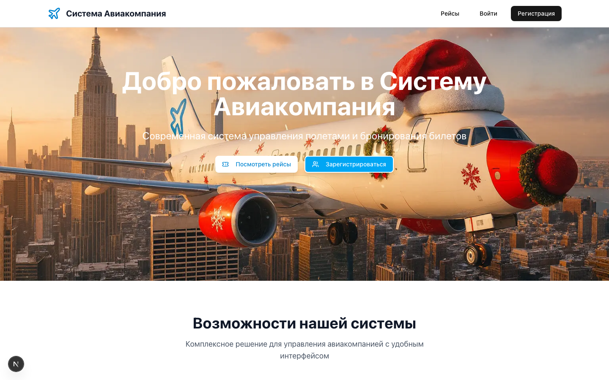
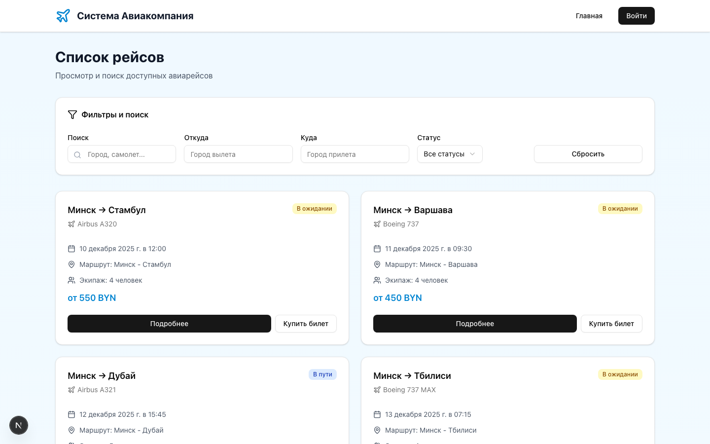
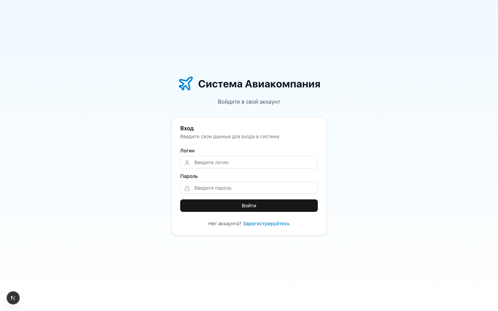
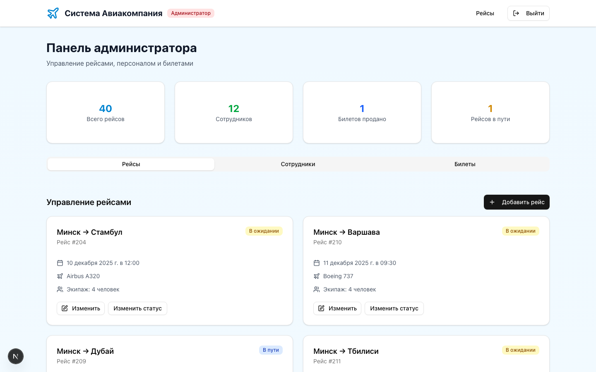
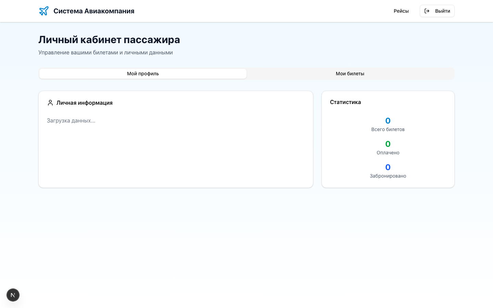

# Система «Авиакомпания»

Веб-приложение для управления авиакомпанией: рейсы, персонал, пассажиры и онлайн-бронирование билетов с двумя уровнями доступа — администратор и пассажир.



---

## Возможности

- **Рейсы** — поиск и фильтрация по городу, направлению и статусу; создание и редактирование рейсов
- **Бронирование билетов** — покупка и управление билетами онлайн
- **Личный кабинет пассажира** — профиль, мои билеты, статистика
- **Панель администратора** — управление рейсами, сотрудниками и билетами, статистика системы
- **Аутентификация** — регистрация, вход, роли `admin` и `passenger`, разграничение прав
- **Экипаж** — назначение сотрудников на рейсы

## Скриншоты

| Рейсы | Вход |
|---|---|
|  |  |

| Панель администратора | Кабинет пассажира |
|---|---|
|  |  |

## Стек технологий

| Слой | Технологии |
|---|---|
| Frontend | Next.js 15 (App Router), React 19, TypeScript |
| UI | Tailwind CSS, shadcn/ui, Radix UI |
| Backend | Next.js API Routes, Node.js |
| База данных | SQLite через Prisma ORM |
| Состояние | React Hooks, TanStack Query |
| Формы и валидация | React Hook Form, Zod |

## Быстрый старт

```bash
# 1. Клонировать и установить зависимости
git clone https://github.com/nekitnet/airline-system.git
cd airline-system
npm install

# 2. Настроить переменные окружения
cp .env.example .env

# 3. Создать базу данных и наполнить тестовыми данными
npx prisma db push
npm run db:seed

# 4. Запустить
npm run dev
```

Приложение: [http://localhost:3000](http://localhost:3000)

### Тестовые аккаунты

| Роль | Логин | Пароль |
|---|---|---|
| Администратор | `admin` | `admin123` |
| Пассажир | `ivanov` | `1234` |

## Структура проекта

```
├── src/
│   ├── app/
│   │   ├── api/               # REST API
│   │   │   ├── auth/          # вход и регистрация
│   │   │   ├── flights/       # рейсы
│   │   │   ├── passengers/    # пассажиры
│   │   │   ├── staff/         # персонал
│   │   │   └── tickets/       # билеты
│   │   ├── admin/             # панель администратора
│   │   ├── flights/           # список рейсов
│   │   ├── passenger/         # личный кабинет
│   │   ├── login/             # вход
│   │   └── register/          # регистрация
│   ├── components/            # UI-компоненты
│   ├── hooks/                 # пользовательские хуки
│   └── lib/                   # утилиты
├── prisma/
│   ├── schema.prisma          # схема базы данных
│   └── seed.ts                # тестовые данные
├── docs/
│   ├── screenshots/           # скриншоты приложения
│   └── *.md, *.html           # отчёты по тестированию
└── public/                    # статические ресурсы
```

## API

| Метод | Эндпоинт | Описание |
|---|---|---|
| POST | `/api/auth/login` | Вход |
| POST | `/api/auth/register` | Регистрация |
| GET / POST | `/api/flights` | Список / создание рейсов |
| GET | `/api/flights/[id]` | Информация о рейсе |
| GET | `/api/flights/[id]/crew` | Экипаж рейса |
| GET / POST | `/api/staff` | Список / создание сотрудников |
| GET | `/api/staff/[id]` | Информация о сотруднике |
| GET / POST | `/api/passengers` | Пассажиры |
| GET | `/api/passengers/user/[userId]` | Пассажир по пользователю |
| GET / POST | `/api/tickets` | Билеты |
| GET | `/api/tickets/passenger/[userId]` | Билеты пассажира |

## Модели данных

`User` — пользователи и роли · `Passenger` — данные пассажиров · `Flight` — рейсы · `Staff` — сотрудники · `CrewMember` — назначения на рейсы · `Ticket` — билеты

## Безопасность

- Аутентификация с ролями (администратор / пассажир)
- Валидация входных данных (Zod)
- Защита от SQL-инъекций через Prisma ORM
- `.env` в `.gitignore`, секреты не попадают в репозиторий

## Лицензия

Учебный проект. Все права защищены.
